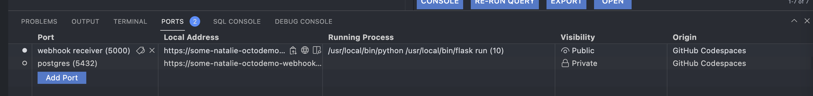
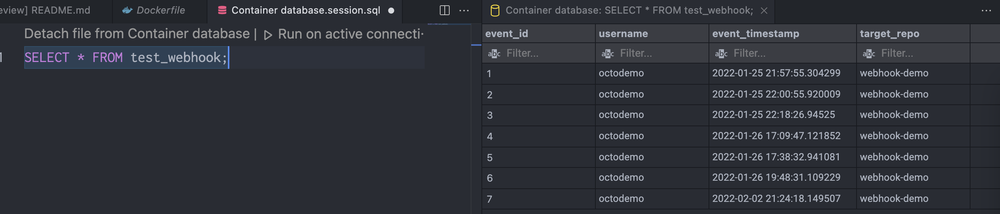
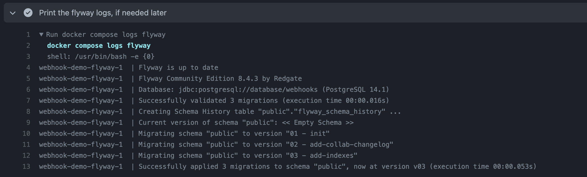

# Demos run from this repo

- [Codespaces](#codespaces)
- [Database schema management](#database-schema-management)
- [GHAS code quality](#code-quality)
- [Dependabot](#dependabot)
- [Scrum](#scrum)

---

## Codespaces

First, intro Codespaces with some cool slides!  Next, let's open the repo and walk through a couple things before launching a Codespace.

This repo has a custom [devcontainer.json](.devcontainer/devcontainer.json) file, so you won't have the default [kitchen sink](https://docs.github.com/en/codespaces/setting-up-your-project-for-codespaces/introduction-to-dev-containers#using-the-default-dev-container-configuration) image.  If you want, the source code to the default image is [here](https://github.com/microsoft/vscode-dev-containers/tree/main/containers/codespaces-linux).  It's a lot to look at, so this one is both simple and custom. :)

It installs and configures some custom extensions in VS Code ([here](.devcontainer/devcontainer.json#L21-L41)), spins up all the containers defined in [`docker-compose.yml`](docker-compose.yml), and starts the Flask app.  The ports are labelled and privately exposed by default.

Now launch a new Codespace from the main branch.  Expose port 5000 publicly, then copy "Local Address" URL.  Send a repo webhook to that URL (type `application/json`), appended by `/webhook`.  It'll look something like this `https://your-codespace-url-5000.githubpreview.dev/webhook`.  



Note how it populates the `test_webhook` table with the repo owner, repo name, and timestamp with [this SQL query](sql/queries/webhook-events.sql), pasted below.

```sql
SELECT * FROM test_webhook;
```



Note how fast it launched?  It's prebuilt off the main branch.  The setting is controlled [here](https://github.com/octodemo/webhook-demo/settings/codespaces).  Prebuilds are run automatically from GitHub Actions and you can see the output of the latest builds [here](https://github.com/octodemo/webhook-demo/actions/workflows/codespaces/create_codespaces_prebuilds).  This is a pretty small image, so builds don't take long, but for larger or more complicated repositories this can save 20+ minutes on custom image builds!

No chat is complete without policy and governance.  You should walk through this at the [organization](https://github.com/organizations/octodemo/settings/codespaces) level and check out the [documentation](https://docs.github.com/en/enterprise-cloud@latest/codespaces/managing-codespaces-for-your-organization).  :heart:

## Database schema management

This repo uses [FlywayDB](https://flywaydb.org/) to manage the database schema in git.  The schema and config files are all in the [sql](sql) directory.  Docker Compose will run `flyway migrate` on the empty database, which is great for development and testing.  FlywayDB will apply the [versioned](sql/migrations/versioned/) migrations, then seed a table with some data in a [repeatable](sql/migrations/repeatable/) migration.  It's also a PR check run by a GitHub Actions workflow [here](.github/workflows/db.yml), and it will always print the logs in case it's needed for troubleshooting.



An example of it failing because of an invalid schema change is in this [pull request](https://github.com/octodemo/webhook-demo/pull/23).  Note how it's unable to merge because this is a required check.

## GitHub Advanced Security

Don't use this as your main demo for security stuff.  It's not supposed to replace more mature demos, only to highlight a couple things that have come up as edge cases where I didn't have an easy answer.  This is a really REALLY simple Flask app.

### Code quality

It has some "code smells" found through the `security-and-quality` query pack ([here](.github/workflows/codeql-analysis.yml#L48)), visible in the Security dashboard.  It should find some unused imports and variables that are declared and not used.

Not part of Advanced Security, but perhaps worth mentioning is that the [super-linter](https://github.com/github/super-linter) helps us maintain clean code by linting the Python code with [this workflow](.github/workflows/linter.yml).  The [blog post](https://github.blog/2020-06-18-introducing-github-super-linter-one-linter-to-rule-them-all/) does a great job summarizing how awesome this Action truly is.

### Dependabot

There's nothing much to see here other than some [pull requests](https://github.com/octodemo/webhook-demo/pulls?q=is%3Apr+is%3Aclosed+author%3Aapp%2Fdependabot) for out of date dependencies and an overview of the [security alerts](https://github.com/octodemo/webhook-demo/security/dependabot?q=is%3Aclosedt) for it.  The [`dependabot.yml`](.github/dependabot.yml) file is a nice example of it checking for dependencies in multiple languages and the [documentation](https://docs.github.com/en/enterprise-cloud@latest/code-security/dependabot/dependabot-version-updates/configuration-options-for-the-dependabot.yml-file) is excellent.

## Scrum

There's some scrum-y things in this repo too.  The first is an [issue template](.github/ISSUE_TEMPLATE/scrum.md) and [workflow](.github/workflows/scrum.yml) that opens a weekly planning issue to run sprint planning, using [this Action](https://github.com/imjohnbo/issue-bot).  The schedule can be changed as needed in the workflow.  The workflow is currently disabled because this is a demo repo and I don't want it to be annoying anyone.

Next is a pair of shiny project boards.  Both have a bit of automation built in to explore too. :)

1. The legacy Projects kanban-style board is [here](https://github.com/octodemo/webhook-demo/projects/1)
2. The new Projects board is [here](https://github.com/orgs/octodemo/projects/62)
